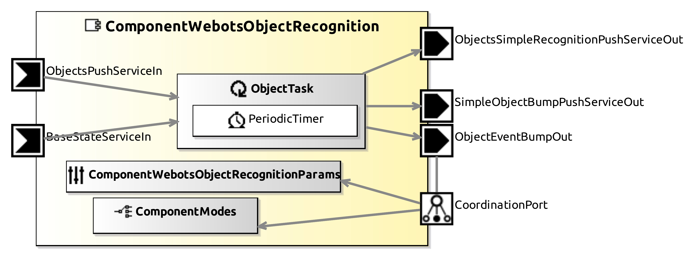

# ComponentWebotsObjectRecognition

This Component provides Object Recognition events and types.

## Service Ports

| Inputs  | outputs |
| ------- | ------- |
| **BaseStateServiceOut**: state of the robot base (position and orientation) | **ObjectEventBumpOut**: Event triggered when desired type of object (parameter) is close to the robot or any, if none was specified |
| **ObjectPushServiceOut**: recognized objects and properties | **ObjectsSimpleRecognitionPushServiceOut**: Vector of simple objects types in database (pre-defined enum) |
| | **SimpleObjectBumpPushServiceOut**: Service that periodically outputs objects that are too close to the robot or just when the desired type of object is close

Known datatypes are: UNKOWN; SOFA; CHAIR; PORTRAIT; TABLE; BED; CAN; APPLE; GNOME; SWINGCOUCH; WATERINGCAN; BISCUITBOX; JAMJAR; ATM; BENCH; PUBLICBIN; SIMPLEBENCH; SNACKSTAND; TRASHBIN; TRASHCONTAINER; PEDESTRIAN.

## InternalParameter Settings

### Object Properties

| Attribute Name | Attribute Type | Description |
|----------------|----------------|-------------|
| **object_bump_threshold** | Double | The distance to trigger the event (object is considered too close in this threshold) |
| **object_bump_type** | String | The wanted type: event will only trigger for that type. If empty, it triggers for all types |
