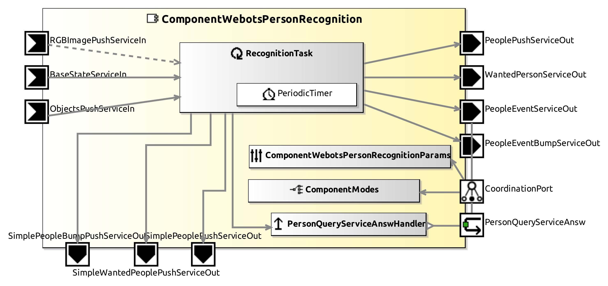

# ComponentWebotsPersonRecognition

This Component provides the recognized person information (name, id, other data), compairing characteristics in a "people.json" file with the object information got by the robot's camera.

## Service Ports

| Inputs  | outputs |
| ------- | ------- |
| **ObjectPushServiceIn**: recognized objects and properties | **PersonRecognitionServiceOut**: Person data |
| **RGBImagePushServiceOut**: Camera image |  |

## InternalParameter Settings

### Recognition Properties

| Attribute Name | Attribute Type | Description |
|----------------|----------------|-------------|
| **color_base** | Boolean | true if one want to use person recognition by json file comparison |