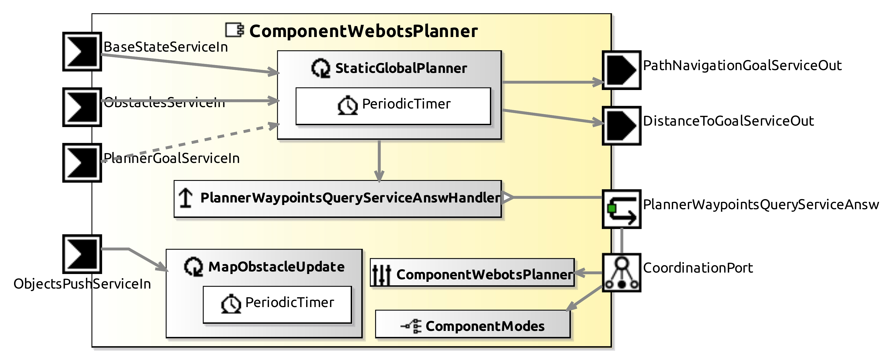

# ComponentWebotsPlanner

This Component provides Path Planning strategies in Webots. Currently, it solves the static global planner using the OMPL library and the static obstacles in the map provided by the ComponentWebotsRobot (webots nodes). It generates waypoints for a local planner.

## Service Ports

| Inputs  | outputs |
| ------- | ------- |
| **BaseStateServiceIn**: robot's pose | **PathNavigationGoalServiceOut**: The feasible waypoints (no static obstacles in the path) |
| **ObstaclesServiceIn**: static obstacles in the map | **PlannerWaypointsQueryServiceAnsw**: Skill answer (Lisp) for a GoTo query in the static map (waypoints) |
| **PlannerGoalServiceIn**: Not used (yet) | **DistanceToGoalServiceOut**: It provides the manhattan and euclidean distance to goal (L1 and L2) |

## InternalParameter Settings

### robot

| Attribute Name | Attribute Type | Description |
|----------------|----------------|-------------|
| **footprint** | Double[4] | Robot bounding box Xmin, Ymin, Xmax, Ymax for obstacle avoidance |