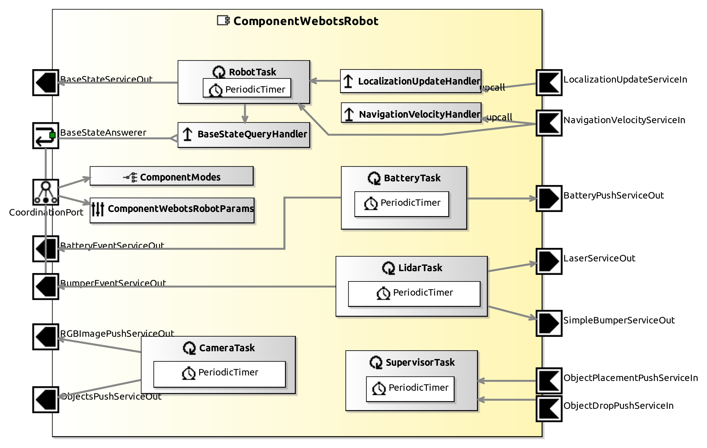

# ComponentWebotsRobots

This Component provides sensors raw data and it updates the robot controller. One must "Enable" the available sensor in component parameters.

## Service Ports

| Inputs  | outputs |
| ------- | ------- |
| **LocalizationUpdateServiceIn**: not implemented yet | **BatteryPushServiceOut**: Battery status (level, power and others) |
| **NavigationVelocityServiceIn**: velocity commands (linear velocities and turnrate) | **BaseStateServiceOut**: state of the robot's base (position and orientation) |
| **ObjectPlacementPushServiceIn**: HRI to query an object placement on it | **LaserServiceOut**: Lidar values |
| **ObjectDropPushServiceIn**: HRI to query an object drop | **ObjectPushServiceOut**: recognized objects and properties |
| | **RGBImagePushServiceOut**: Camera image |
| | **BumperEventServiceOut**: It triggers if robot is too close to something |
| | **SimpleBumperServiceOut**: It periodically sends info about robot state of "bump" (too close or far from objects/people) |
| | **BatteryEventServiceOut**: It triggers if battery's level is below threshold |
| | **BaseStateAnswerer**: It is possible to send Lisp commands to query robot's base info |
| | **PayloadServiceOut**: It periodically outputs the robot's payload (currently only the mass property) |

## InternalParameter Settings

### Battery Properties

| Attribute Name | Attribute Type | Description |
|----------------|----------------|-------------|
| **custom_battery** | Boolean | true if one want to use estimation in BatteryTask |
| **battery_level_init** | Double | Initial battery level |
| **battery_level_max** | Double | Maximum battery level |
| **battery_level_min** | Double | Minimum battery level (robot stops) |
| **cpu_consumption** | Double | CPU (or electronics) consumption |
| **motor_consumption** | Double | Motor consumption factor (linear with velocity) |

### Lidar Properties

| Attribute Name | Attribute Type | Description |
|----------------|----------------|-------------|
| **enable** | Boolean | true if one want to use Lidar sensor |
| **bumper_threshold** | Double | Min Distance to obstacle [m] to trigger event |

### Camera Properties

| Attribute Name | Attribute Type | Description |
|----------------|----------------|-------------|
| **enable** | Boolean | true if one want to use Camera sensor |
| **enable_recognition** | Boolean | true if one want to Webots Camera Recognition |
| **camera_rotation_matrix** | Double[*] (matrix 3x3) | Camera rotation matrix wrt to the robot frame (default is the TiagoIron matrix) |
| **camera_translation** | Double[*] (vector3D) | Camera translation vector wrt to the robot frame in meters |

### Robot Properties

| Attribute Name | Attribute Type | Description |
|----------------|----------------|-------------|
| **kinematics** | String | Robot Kinematics type |
| **wheel_distance** | Double | Distance between wheels (meters) |

### HRI

| Attribute Name | Attribute Type | Description |
|----------------|----------------|-------------|
| **max_size** | Double | Max object' size in meters that robot can transport |
| **offset** | Double[*] | Offset from the robot's pose (x,y,z) where to place the object in meters |
