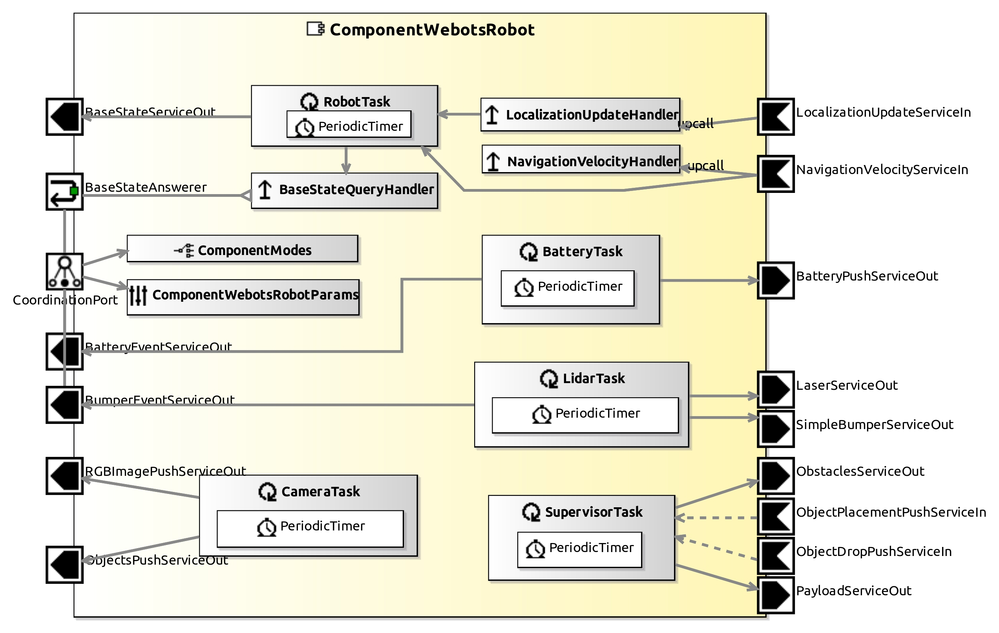

# ComponentWebotsRobots

This Component provides sensors raw data and it updates the robot controller. One must "Enable" the available sensor in component parameters. 

## Service Ports

| Inputs  | outputs |
| ------- | ------- |
| **LocalizationUpdateServiceIn**: not implemented yet | **BatteryPushServiceOut**: Battery status (level, power and others) |
| **NavigationVelocityServiceIn**: velocity commands (linear velocities and turnrate) | **BaseStateServiceOut**: state of the robot base (position and orientation) |
| | | **LaserServiceOut**: Lidar values |
| | | **ObjectPushServiceOut**: recognized objects and properties |
| | | **RGBImagePushServiceOut**: Camera image |

## InternalParameter Settings

### Battery Properties

| Attribute Name | Attribute Type | Description |
|----------------|----------------|-------------|
| **custom_battery** | Boolean | true if one want to use estimation in BatteryTask |
| **battery_level_init** | Double | Initial battery level |
| **battery_level_max** | Double | Maximum battery level |
| **battery_level_min** | Double | Minimum battery level (robot stops) |
| **cpu_consumption** | Double | CPU (or electronics) consumption |
| **motor_consumption** | Double | Motor consumption factor (linear with velocity) |

### Lidar Properties	

| Attribute Name | Attribute Type | Description |
|----------------|----------------|-------------|
| **enable** | Boolean | true if one want to use Lidar sensor |

### Camera Properties

| Attribute Name | Attribute Type | Description |
|----------------|----------------|-------------|
| **enable** | Boolean | true if one want to use Camera sensor |
| **enable_recognition** | Boolean | true if one want to Webots Camera Recognition |
